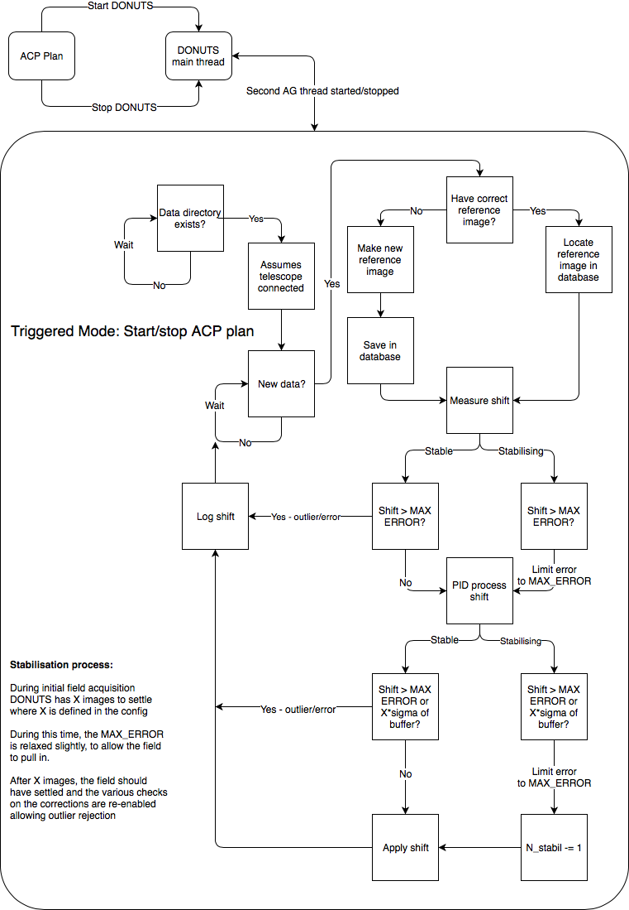

# ACP Autoguiding with DONUTS

Donuts is an autoguiding algorithm that can guide on defocused images. It relies on a reference image of each target. This image is aquired during the first ever observation and is used to reposition the field to sub-pixel precision on subsequent nights.

The algorithm is currently in use at the NGTS, SPECULOOS, NITES and W1m telescopes in Chile and La Palma. This package is a custom wrapper for Donuts which allows guiding of equatorial telescopes that are controlled using ACP and an ASCOM driver. Commands are sent to the telescope using the ACP telescope hub and the ```pulseGuide``` software guiding command.

This package can run as a daemon where autoguiding is controlled using a custom ```TAG``` from an ACP plan, or Donuts can be started/stopped manually from the command line. The former requires some additional setup using the optional steps below

This package is freely available under the standard MIT open source license.

# Package contents

This package contains a series of scripts and software used for setting up, calibrating and running Donuts with ACP. Below is a brief description of the main components:

   1. Operations:
      1. In the ```acp/``` folder there is a modified version of the ACP ```UserActions.wsc``` file. This is used to trigger autoguiding from ACP plans
      1. A daemon script ```donuts_process_handler.py```. This code runs all the time listening for commands from ACP to start and stop the guiding. The commands are triggered by the custom ```UserActions.wsc``` script above
      1. A shim ```donuts_process.py```, which ```UserActions.wsc``` calls to insert jobs into the daemon using Pyro. The ```donuts_process.py``` script can also be used to manually start and stop guiding if required (e.g. in an emergency or if you wish to run Donuts without a daemon)
      1. The DONUTS main autoguiding code ```acp_ag.py```. This script does all the shift measuring and telescope movements
      1. A per instrument configuration file, e.g.: ```nites.py```, ```speculoos_io.py``` etc. This file contains information such as field orientation and header keyword maps. A new file like this is required for each new instrument

   1. Admin:
      1. A script to calibrate the autoguiding pulseGuide command, ```calibrate_pulse_guide.py```
      1. A script to update a field's autoguider reference image with a new one, ```setnewrefimage.py```. This is used when the old image is no longer suitable and you have a new image on disc that you would like to use.
      1. A script to stop field's current autoguider reference image, ```stopcurrentrefimage.py```. This is used to remove a reference frame and let DONUTS make a new one automatically next time it observes that field.

# Installation and setup

Automating Donuts requires a non-trival amount of setup. Please contact me if you have difficulties or questions regarding the steps below.
First install GitHub Desktop, this can be used to download everything else that is required. This can be found at www.desktop.github.com


## Installing prerequisite software

Follow the steps below to install the prerequisite software required to run Donuts on Windows. The installers supplied in the ```install/``` folder have been tested on Windows 7 and 10.

   1. Sign into GitHub desktop using your GitHub account.
   1. Clone the DONUTS\_ACP repository -  *https://github.com/jmccormac01/DONUTS_ACP.git*
   1. Install mysql - *mysql-installer-web-community-5.7.21.0.msi*
      1. Choose a custom install
      1. Install the server and shell only
      1. It will ask for a root username and password, remember these for later
      1. Create a normal user as well as root, remember the login details for later
   1. Install miniconda3-latest - *Miniconda3-latest-Windows-x86_64.exe*
   1. Once miniconda is installed, open a prompt and run the commands below:
      1. conda install numpy
      1. conda install scipy
      1. conda install astropy
      1. conda install scikit-image
      1. conda install pymysql
      1. pip install Pyro4
      1. pip install donuts

## Setting up MySQL database and autoguiding tables

A MySQL database is used to store information on the autoguiding reference images and the stats from the autoguiding in real time. Set up the database as follows:

   1. Open a MySQL terminal
   1. Enter SQL mode using ```\sql```
   1. Connect to the local database using ```\c localhost```
   1. Enter the username/password used during the installation
   1. Create a new database to hold the autoguiding tables, e.g. ```telescopename_ops```
   1. Create three tables using the schemas below. The multiline ```CREATE TABLE``` commands can be pasted into the terminal.
   1. Add the database name, database host, username and password to the instrument configuration file (see below).

```sql
CREATE TABLE autoguider_ref (
  ref_id mediumint auto_increment primary key,
  field varchar(100) not null,
  telescope varchar(20) not null,
  ref_image varchar(100) not null,
  filter varchar(20) not null,
  valid_from datetime not null,
  valid_until datetime
);

CREATE TABLE autoguider_log_new (
   updated timestamp default current_timestamp on update current_timestamp,
   night date not null,
   reference varchar(150) not null,
   comparison varchar(150) not null,
   stabilised varchar(5) not null,
   shift_x double not null,
   shift_y double not null,
   pre_pid_x double not null,
   pre_pid_y double not null,
   post_pid_x double not null,
   post_pid_y double not null,
   std_buff_x double not null,
   std_buff_y double not null,
   culled_max_shift_x varchar(5) not null,
   culled_max_shift_y varchar(5) not null
);

CREATE TABLE autoguider_info_log (
   message_id mediumint not null auto_increment primary key,
   updated timestamp default current_timestamp on update current_timestamp,
   telescope varchar(20) not null,
   message varchar(500) not null
);
```

## Instrument configuration

Create a new instrument configuration file in the ```DONUTS_ACP``` folder. Use the NITES or SPECULOOS files as a template and add your specific values. Below is an example of the NITES configuration.

```python
"""
Confiuguration parameters for NITES
"""
# e.g. .fits or .fit etc
IMAGE_EXTENSION = "*.fts"

# header keyword for the current filter
FILTER_KEYWORD = 'FILTER'

# header keyword for the current target/field
FIELD_KEYWORD = 'OBJECT'

# RA axis alignment along x or y?
RA_AXIS = 'y'

# imager position angle
CAMERA_ANGLE = 0.0

# guider log file name
LOGFILE = "guider.log"

# rejection buffer length
GUIDE_BUFFER_LENGTH = 20

# number images allowed during pull in period
IMAGES_TO_STABILISE = 10

# outlier rejection sigma
SIGMA_BUFFER = 5

# pulseGuide conversions
# these values come from running calibrate_pulse_guide.py
PIX2TIME = {'+x': 100.00,
            '-x': 100.00,
            '+y': 100.00,
            '-y': 100.00}

# guide directions
# these values come from running calibrate_pulse_guide.py
DIRECTIONS = {'+y': 0, '-y': 1, '+x': 2, '-x': 3}

# max allowed shift to correct
MAX_ERROR_PIXELS = 20

# max alloed shift to correct during stabilisation
MAX_ERROR_STABIL_PIXELS = 40

# ACP data base directory
BASE_DIR = "C:\\data"
AUTOGUIDER_REF_DIR = "C:\\data\\autoguider_ref"
PYTHONPATH = "C:\\ProgramData\\Miniconda3\\python.exe"
DONUTSPATH = "C:\\Users\\nites\\Documents\\GitHub\\DONUTS_ACP"

# PID loop coefficients
PID_COEFFS = {'x': {'p': 1.0, 'i': 0.5, 'd': 0.0},
              'y': {'p': 1.0, 'i': 0.5, 'd': 0.0},
              'set_x': 0.0,
              'set_y': 0.0}

# database set up
DB_HOST = "localhost"
DB_USER = "nites"
DB_DATABASE = "nites_ops"
DB_PASS = "nites"

# observatory location for sun calculations
# both values are in degrees, -ve values for West of Greenwich
OLAT = 28.+(40./60.)+(00./3600.)
OLON = -17.-(52./60.)-(00./3600.)
ELEV = 2326.

# set the limit where donuts will shut off automatically
SUNALT_LIMIT = 0
```

# Setting up daemon mode

## Registering custom user actions script with ACP

Running Donuts as a daemon requires connecting the Python code to ACP. This is done using a custom ```UserActions``` script.
The ```UserActions<INSTRUMENT_NAME>.wsc``` script allows ACP to call our custom python code. On 64bit operating systems it
needs registering as follows:

   1. Run C:\Windows\SysWOW64\cmd.exe   **(Note:SysWOW64!)**
   1. cd "\Program Files\ACP Obs Control"
   1. ...> regsvr32 UserActions<INSTRUMENT_NAME>.wsc


## Running daemon mode

The custom ```UserActions``` script sets up a new ```TAG``` command.
When ACP sees the request for Donuts via the custom ```TAG``` it triggers the Donuts daemon to spawn an autoguiding process.
The new ```UserActions``` script also allows ACP to automatically stop autoguiding processes at the end of an observing block.
Below is an example extract from an ACP plan where Donuts is enabled for the first object and is disabled for the second.
Ommitting the call to enable Donuts ACP has the same effect as using ```TAG Donuts=off```. **Note: the TAG command is case sensitive**.

```sh
# TAG Donuts=on
Target1<tab>10:00:00<tab>+20:00:00

Target2<tab>14:00:00<tab>+10:00:00
```

A ```UsersActions``` script is required for each installation of this package. Please contact me and I can prepare one for your project

# A note on reference images

Reference images are critical to the successful operation of Donuts. The goal of the reference image is to provide long-term stable tracking performance. If the anything on the telescope changes, such as the camera is removed and reinstalled, the previous reference images become invalid and need disabling.

The ```stopcurrentrefimage.py``` script can be used to disable the reference image of a given field. Donuts will then spot there is no valid reference image and aquire a new one during the next night.


# Calibrating Donuts on sky

## Calibrating camera scale and orientation

The ```pulseGuiding``` command must be calibrated before Donuts can convert pixel offsets to on-sky movments.
The ```calibrate_pulse_guide.py``` script automatically determines the scale and orientation of the camera. To calibrate pulseguide:

   1. Manually point the telescope to LST+1h in RA and 0deg in Dec and make the telescope track this position.
   1. In an Anaconda terminal go to the ```DONUTS_ACP``` folder and run the command:
      1. *python calibrate_pulse_guide.py TELESCOPE_NAME --analyse*
      1. This will take a series of images while nudging the telescope up/down/left/right in between and measuring the offsets.
      1. The pattern is repeated 10 times and the results are returned at the end.
   1. The resulting scales and directions from ```calibrate_pulse_guide.py``` should be added the instrument configuration file under the parameters ```PIX2TIME``` and ```DIRECTIONS```. Example values can be seen in the config file above.

If a camera is removed, rotated or the telescope is modified in any way requiring a new pointing model, then the ```pulseGuide``` command should be recalibrated using the steps above.

## Calibrating autoguiding control loop

Tuning PID loops is an art in itself. Documenting that here is beyond the scope of this readme. I am happy to tune telescopes on a case by case basis.

# Operation of Donuts

Donuts can be operated using the daemon mode described above or triggered manually from the command line by the observer. Operational instructions can be written on a case by case basis.

## Schematic




# Contributors

James McCormac

# License

Copyright 2019 James McCormac

Permission is hereby granted, free of charge, to any person obtaining a copy of this software and associated documentation files (the "Software"), to deal in the Software without restriction, including without limitation the rights to use, copy, modify, merge, publish, distribute, sublicense, and/or sell copies of the Software, and to permit persons to whom the Software is furnished to do so, subject to the following conditions:

The above copyright notice and this permission notice shall be included in all copies or substantial portions of the Software.

THE SOFTWARE IS PROVIDED "AS IS", WITHOUT WARRANTY OF ANY KIND, EXPRESS OR IMPLIED, INCLUDING BUT NOT LIMITED TO THE WARRANTIES OF MERCHANTABILITY, FITNESS FOR A PARTICULAR PURPOSE AND NONINFRINGEMENT. IN NO EVENT SHALL THE AUTHORS OR COPYRIGHT HOLDERS BE LIABLE FOR ANY CLAIM, DAMAGES OR OTHER LIABILITY, WHETHER IN AN ACTION OF CONTRACT, TORT OR OTHERWISE, ARISING FROM, OUT OF OR IN CONNECTION WITH THE SOFTWARE OR THE USE OR OTHER DEALINGS IN THE SOFTWARE.
