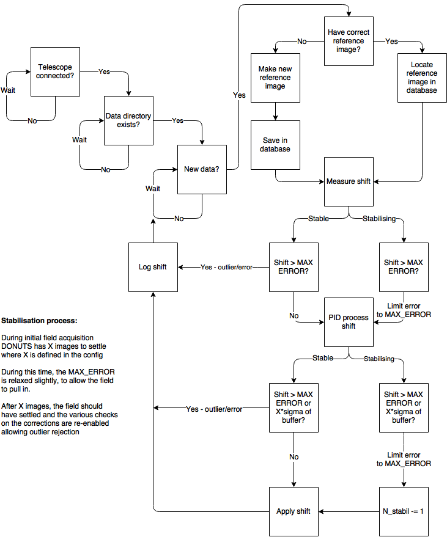

# ACP Autoguiding with DONUTS

Autoguiding ACP driven telescopes using DONUTS

# Setup

Clone this repository to the TCS

```sh
$> cd path/to/ag/code/home
$> git clone url/for/ag/code
```

Add and configure an instrument specific configuration file.

# SPECULOOS Usage

```sh
$> Open Anaconda Prompt
$> cd C:\Users\speculoos\Documents\GitHub\DONUTS_ACP\
$> python acp_ag.py speculoos_io [--debug]
```

# Schematic



# Contributors

James McCormac

# License

MIT
